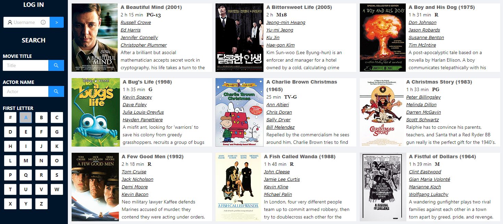
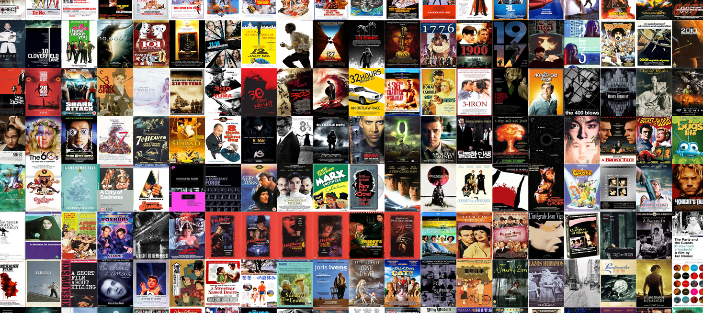

# Movie Theater Site

 I've always been a big fan of cinema, and streaming services have made it easier than ever to share beloved movies with friends. I use software such as [Plex](https://www.plex.tv/) and [SyncLounge](https://synclounge.tv/) to have an online movie nights with friends. I wanted a tool to track movies we had access to watch, while letting me develop useful custom features. This site was first built in ASP.Net MVC, then migrated to .Net Core. A new front-end driven by React is currently underway, and can be seen in the React branch.

 A brief list of features included in the site:
 
 * Movie Data & Posters - Data has been retrieved through various methods including web scraping and API access. Posters were once stored as BLOBs, but I found it faster and less resource-intensive to store them as files. When a new movie is added to the site a Python script is ran to create a high quality/small sized thumbnail, which is used when browsing for movies.
 
 * Users - A typical ASP.Net Identity implementation would be trivial, but this site is communally shared between a group of friends with no private data. After initial design discussions, I decided to create a very simple user implementation that does not require passwords for login. It's thus trivial for any user to check or update another user's information, which matches the intent of the site. 
 
 * Has Watched List - Once logged in, a user can mark each movie they've watched. They can then see the number of movies they've ever watched, or filter to see the information for each of those movies.
 
 * Want To Watch List - Similar to the above feature, but used for movies you want to watch in the future. This allows me to find movies multiple people care to watch when picking what to watch on movie night.
 
 * Movie Rating - Users are able to rate movies and compare to the ratings from other users.
 
 * Collage - The site can generate one massive collage of all movie posters. Eventually I plan to add the ability to generate mosaics from movie posters. Example image:
 
 (Note: The full collage is much larger, coming in at a massive 1,875px x 21,500px)